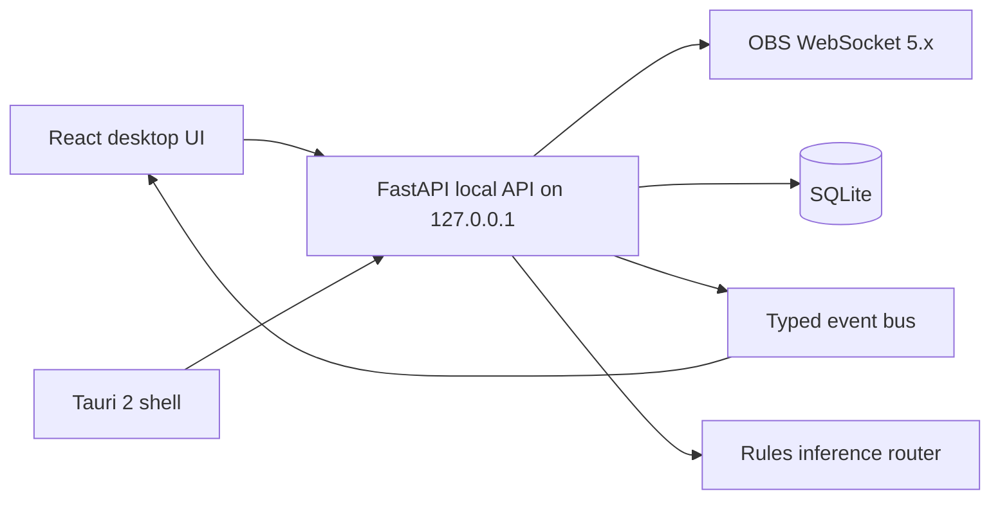

# VASP Companion

VASP Companion is a local-first AI producer foundation for OBS Studio. The MVP connects to OBS WebSocket 5.x, exposes safe scene, recording, replay, mute, command, session, highlight, event, and manifest APIs, and ships a demo mode that works without OBS.




## Current MVP Features

- Secure local API surface with bearer-token auth and strict localhost binding.
- Demo OBS mode with Starting Soon, Gameplay, Just Chatting, and BRB scenes.
- Real OBS WebSocket 5.x integration using modern request names.
- Deterministic command parsing for scene switching, mute, recording, replay, and highlights.
- SQLite sessions and highlights with JSON manifest export.
- Live event WebSocket, bounded UI event feed, and diagnostics endpoint.
- Tauri 2 shell scaffold with port and secret preparation.

## Prerequisites

Install Git, Node.js LTS, npm, Rust/Cargo, Python 3.12, and uv. Tauri also requires platform WebView prerequisites.

## Windows Setup

```powershell
cd "C:\Users\SHIVANG\AI\OBS Companion\vasp-companion"
.\scripts\setup.ps1
```

## macOS Setup

Install Node.js, Rust, Python 3.12, and uv, then run:

```bash
npm install
cd apps/local-api && uv sync
```

## Linux Setup

Install the Tauri Linux prerequisites for your distribution, then run the same npm and uv setup commands.

## Enable OBS WebSocket

OBS 28+ includes obs-websocket. Open OBS, go to `Tools -> WebSocket Server Settings`, enable the server, keep the default port `4455`, and copy the password if authentication is enabled.

## Demo Mode

Terminal 1:

```powershell
cd "C:\Users\SHIVANG\AI\OBS Companion\vasp-companion"
.\scripts\dev.ps1
```

Terminal 2:

```powershell
cd "C:\Users\SHIVANG\AI\OBS Companion\vasp-companion"
npm run dev
```

Open `http://127.0.0.1:5173`, choose Demo Mode, start a session, switch scenes, run `mute microphone`, create a highlight, and export the manifest.

## Connect To Real OBS

Start the backend and frontend as above, then enter host `127.0.0.1`, port `4455`, and your OBS WebSocket password in the onboarding form. The password is submitted only to the local backend and is not stored.

## Development Commands

```powershell
make setup
make dev
make dev-api
make dev-desktop
make test
make lint
make typecheck
make contracts
make build
```

PowerShell equivalents live in `scripts/`.

## Testing

Backend tests use `FakeObsService`; CI does not require OBS. Frontend tests use mocked backend responses and browser-level UI rendering.

## Repository Layout

- `apps/local-api`: FastAPI, OBS communication, command policy, SQLite persistence.
- `apps/desktop`: React, TypeScript, Vite, Tailwind, Tauri shell.
- `packages/contracts`: generated TypeScript contract package.
- `packages/plugin-sdk`: minimal Python plugin protocol.
- `docs`: architecture, development, product, security notes.

## Security And Privacy

The app binds only to localhost, requires auth for API calls, does not expose arbitrary file, URL, or shell endpoints, avoids storing OBS passwords, and redacts credential-shaped data. See `docs/security/threat-model.md`.

## Roadmap

The MVP does not continuously understand gameplay, automatically create Shorts, upload stream content, or require a cloud account. It uses deterministic command parsing by default and leaves clean extension points for local, cloud, and hybrid AI later.

See [ROADMAP.md](ROADMAP.md) for the full plan, including the free local-LLM voice co-host.

## Known Limitations

Production sidecar bundling is scaffolded but not frozen into a signed binary yet. In-process third-party plugins are not a true sandbox. Full Tauri E2E automation is documented as future work; browser-level smoke tests cover the MVP flow.

## License

Apache-2.0
