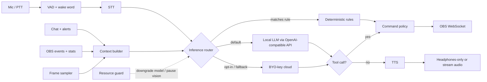

# VASP Companion Roadmap

This document describes what VASP Companion is, what it does today, what it should support, and how we deliver a **free, real-time AI co-host** that talks to the streamer while they record or stream, and that also handles production work around it (scenes, highlights, chat, clips, summaries).

> Status note (2026-10): this repository currently contains only project scaffolding (README, Makefile, package manifests, tooling config). The `apps/local-api`, `apps/desktop`, `packages/contracts`, and `packages/plugin-sdk` directories that the README describes are not committed yet. **Phase 0 below is getting that MVP code into the repo** so the rest of the roadmap has something to build on.

---

## 1. Product vision

VASP Companion is a **local-first AI producer and co-host for OBS Studio**.

- **Producer**: it watches the session (OBS state, audio, chat, optionally screen frames) and does the tedious work: switching scenes, muting, starting/stopping recording, saving replays, marking highlights, building clip lists, writing titles and summaries.
- **Co-host**: the streamer can talk to it out loud while recording. It answers, reacts, reads chat, keeps them company during dead air, and takes spoken commands ("clip that", "switch to BRB", "what did chat say about the boss?").
- **Free by default**: everything works with no account, no API key, and no subscription by running open-weight models on the streamer's own machine. Cloud models are an optional, bring-your-own-key upgrade.
- **Safe by default**: it never does anything to OBS outside an allow-listed policy, never uploads content without explicit consent, and never exposes the local API off-machine.

### Design principles

1. **Local-first, cloud-optional.** The default path must work offline.
2. **Never hurt the stream.** The AI must not drop frames, add audio glitches, or steal GPU from the game/encoder. If it has to choose, it degrades the AI, not the stream.
3. **Deterministic for actions, generative for conversation.** Commands that change OBS go through a typed policy layer; the LLM proposes, the policy decides.
4. **The streamer is in control.** Push-to-talk, a kill switch, visible "AI is listening/speaking" state, and per-feature toggles.
5. **Provider-agnostic.** One internal interface for LLM / STT / TTS / vision; providers are plugins.

---

## 2. What it does today (MVP, as described in README)

| Area        | MVP capability                                                           |
| ----------- | ------------------------------------------------------------------------ |
| Local API   | FastAPI on `127.0.0.1`, bearer-token auth, credential redaction          |
| OBS         | WebSocket 5.x client: scenes, recording, replay buffer, mute             |
| Demo mode   | Fake OBS with Starting Soon / Gameplay / Just Chatting / BRB scenes      |
| Commands    | Deterministic text parser: scene switch, mute, record, replay, highlight |
| Persistence | SQLite sessions and highlights, JSON manifest export                     |
| Events      | Typed event bus, live event WebSocket, bounded UI feed, diagnostics      |
| UI          | React + Vite + Tailwind, Tauri 2 shell scaffold                          |
| Inference   | "Rules" inference router (no LLM yet)                                    |

Explicitly **not** in the MVP: continuous understanding of gameplay, voice conversation, LLMs, auto-generated Shorts, uploads, or cloud accounts.

---

## 3. What it should support (target feature set)

### 3.1 Voice co-host (headline feature)

- Hands-free conversation while recording/streaming: wake word or push-to-talk.
- Low-latency spoken replies (target: first audio < 1.5 s after the streamer stops talking on a mid-range PC).
- Barge-in: streamer can interrupt the AI mid-sentence.
- Selectable personas (hype co-host, calm analyst, silent producer, sarcastic sidekick) with custom system prompts.
- Choice of whether the AI voice is **heard on stream / in the recording** or **only in the streamer's headphones** (routed to a separate audio device).
- Short-term memory of the current session and opt-in long-term memory (recurring viewers, running jokes, game progress).
- Dead-air detection: optional prompts or banter when the streamer has been quiet for N seconds.

### 3.2 Spoken and natural-language control

- Everything the deterministic parser does, but from free-form speech ("can you cut to the break screen and mute me").
- LLM turns speech into **structured tool calls**; the existing command policy validates them; risky actions (stop recording, end stream) require confirmation.
- "Clip that" / "mark that" with automatic replay-buffer save and timestamp.

### 3.3 Stream awareness

- OBS events (scene changes, recording state, dropped frames, bitrate) fed into the AI context.
- Chat integration: Twitch (IRC/EventSub), YouTube Live Chat, Kick (where APIs allow). Summarise chat, answer questions, read selected messages aloud, flag spam/toxicity.
- Alerts: follows/subs/raids/donations as events the co-host can react to.
- Optional vision: low-rate screenshots from an OBS source (the scaffold already has `FRAME_CAPTURE_INTERVAL_SECONDS`) so the co-host can comment on what is on screen.

### 3.4 Production automation

- Highlight detection from multiple signals: voice excitement, chat velocity, keywords, manual marks, game events.
- Post-session report: timeline, highlights, chat summary, suggested titles/descriptions/tags, chapter markers.
- Clip export: cut highlights from the recording with FFmpeg, vertical crop presets for Shorts/Reels/TikTok, auto-captions via STT.
- Upload only on explicit user action (YouTube / TikTok integrations are late-phase and opt-in).

### 3.5 Platform and extensibility

- Windows first (most OBS streamers), then macOS (Apple Silicon is great for local models) and Linux.
- Plugin SDK for new tools, chat platforms, and model providers.
- Overlay browser source (captions, AI "is speaking" indicator, persona avatar) served from the local API.

---

## 4. Free LLMs: how we provide them

The core promise is **"free to talk to"**. We achieve that with three tiers, tried in order, and a hardware-aware setup wizard that picks sensible defaults.

### 4.1 Tier 1 (default): local open-weight models on the streamer's PC

No cost, no key, works offline, nothing leaves the machine.

**Runtime.** We do not ship our own inference engine. We integrate with existing free runtimes through their **OpenAI-compatible HTTP API**, so one client covers all of them:

| Runtime                    | Why                                                         | Notes                                                          |
| -------------------------- | ----------------------------------------------------------- | -------------------------------------------------------------- |
| **Ollama** (MIT)           | Easiest install, model pull/management, Windows/macOS/Linux | Recommended default; wizard can install it and pull models     |
| **llama.cpp server** (MIT) | Smallest footprint, fine-grained GPU layer control          | Can be bundled as a sidecar for a zero-dependency install      |
| LM Studio                  | Friendly GUI many users already have                        | Free to use but not open source; supported as "bring your own" |

**Speech pipeline (all free/open):**

| Stage                    | Default choice                        | Alternatives                           |
| ------------------------ | ------------------------------------- | -------------------------------------- |
| Voice activity detection | Silero VAD                            | WebRTC VAD                             |
| Wake word (optional)     | openWakeWord                          | Push-to-talk hotkey (default)          |
| Speech-to-text           | faster-whisper (`small`/`base`, int8) | whisper.cpp, Moonshine, distil-whisper |
| LLM                      | see model table below                 | —                                      |
| Text-to-speech           | Piper (fast, CPU)                     | Kokoro-82M (higher quality), OS voices |

**Model selection by hardware.** The model shortlist below reflects open-weight families with permissive or usable licenses at time of writing; the wizard reads from a **remote-updatable model catalog** (a JSON file in this repo) so we can swap in newer models without an app release. Verify licenses and sizes when implementing.

| Hardware profile                      | Conversation model                                            | Vision (optional)                  | Expected experience                   |
| ------------------------------------- | ------------------------------------------------------------- | ---------------------------------- | ------------------------------------- |
| CPU only / low-end (≤8 GB RAM free)   | 1–3B instruct, Q4 (e.g. Qwen3 1.7B, Llama 3.2 3B, Gemma 3 1B) | off                                | Usable short replies, ~2–4 s latency  |
| 6–8 GB VRAM GPU (shared with game)    | 3–4B instruct, Q4 (e.g. Qwen3 4B, Gemma 3 4B, Phi-4-mini)     | Gemma 3 4B / Moondream at low rate | Good banter, ~1–2 s                   |
| 12–16 GB VRAM or Apple Silicon 16 GB+ | 7–14B instruct, Q4 (e.g. Qwen3 8B/14B, Gemma 3 12B)           | Qwen2.5-VL 7B / Gemma 3 12B        | Strong co-host, reliable tool calling |
| 24 GB+ VRAM or a second PC            | 14–32B or MoE (e.g. Qwen3 30B-A3B, Mistral Small)             | larger VLM                         | Near-cloud quality                    |

**The GPU contention problem.** The streamer's GPU is already busy rendering the game and (often) encoding with NVENC/AMF. Running an LLM on the same GPU can cause frame drops. Mitigations, in order:

1. **Resource guard**: read OBS stats (render/encode lag, dropped frames) every few seconds; if they degrade, automatically shrink context, switch to a smaller model, move STT/TTS to CPU, or pause vision.
2. **Small models by default** and short responses (co-host replies are 1–3 sentences anyway).
3. **CPU for STT/TTS** (Piper and int8 whisper run fine on CPU), GPU only for the LLM.
4. **Bounded GPU layers** in llama.cpp/Ollama so a fixed VRAM budget is never exceeded.
5. **LAN offload**: point the companion at an Ollama/llama.cpp server on a second PC, laptop, or Mac on the local network (common for dual-PC streaming setups). Same OpenAI-compatible client, just a different host, with an explicit opt-in and pairing token.

### 4.2 Tier 2 (optional): free cloud tiers with the user's own key

For users with weak hardware who still want a smart co-host. The user creates their own free account and pastes a key; we never ship or share keys.

Candidates (all subject to change, verify terms and limits at implementation time): Google AI Studio (Gemini free tier), Groq free tier, OpenRouter's free-model routes, Cloudflare Workers AI free allocation, Hugging Face Inference.

Rules for this tier:

- **Off by default.** Enabling it shows a clear notice that audio transcripts and prompts leave the machine, and that some free tiers may use data for training.
- Keys stored in the OS keychain (Windows Credential Manager / macOS Keychain / libsecret), never in SQLite or logs.
- Rate-limit aware: the router tracks quota and falls back to local automatically.
- Screenshots/vision to cloud require a separate opt-in.

### 4.3 Tier 3 (optional): paid / premium providers

Bring-your-own-key support for paid APIs (Anthropic, OpenAI, Google, Mistral, etc.) for users who want the best quality. Same provider interface, same privacy notices. Not required for any feature.

### 4.4 What we will **not** do (at least initially)

- **Host a "free" project-run inference server.** It is not financially sustainable, creates a privacy liability (we would receive every streamer's audio transcripts), and becomes a single point of failure. If ever reconsidered, it would be a separate, clearly opt-in service with its own privacy policy and funding model.
- Bundle model weights inside the installer (too large; licenses vary). Models are downloaded on first run with a progress UI and checksum verification.

### 4.5 Inference router

- **Rules first**: exact commands ("mute mic") skip the LLM entirely for zero latency and zero risk.
- **Streaming everywhere**: STT partials → LLM token stream → sentence-chunked TTS so speech starts before the full reply is generated.
- **Tool calling**: the LLM sees a typed tool list generated from `packages/contracts`; every call is validated by the existing command policy. Models that are weak at tool calling get a constrained JSON grammar (llama.cpp GBNF / Ollama structured outputs).
- **Context budget**: rolling session summary + last N turns + recent events, sized to the active model's context window.

### 4.6 Latency budget (target, mid-range GPU, local)

| Stage                         | Budget          |
| ----------------------------- | --------------- |
| End-of-speech detection (VAD) | 200–300 ms      |
| STT final                     | 200–400 ms      |
| LLM first sentence            | 300–600 ms      |
| TTS first audio chunk         | 100–200 ms      |
| **Total to first audio**      | **≈ 0.8–1.5 s** |

---

## 5. Audio routing while recording

This is the part most likely to go wrong, so it gets its own design:

- **Input**: the companion captures the mic itself (via the OS audio API), independently of OBS, so it can hear the streamer even when the OBS mic is muted. Optional: listen to desktop/game audio for context (off by default).
- **Output modes**:
  1. _Private co-host_: TTS plays on the streamer's headphones device only; not in the recording.
  2. _On-air co-host_: TTS plays on a dedicated output that OBS captures as its own audio source ("VASP Co-host"), so it can be mixed, ducked, or muted per track. The setup wizard creates/selects this source through OBS WebSocket.
  3. _Text only_: replies shown in the app and/or as an on-stream caption overlay.
- **Echo/feedback**: in on-air mode, don't let the AI hear itself: pause STT while speaking, or use the known TTS signal to cancel it from the mic input.
- **Multi-track recording**: recommend putting the AI voice on a separate OBS audio track so it can be removed in editing.

---

## 6. Phased roadmap

Each phase has an exit criterion; we don't start the next phase's headline feature until the previous one is met.

### Phase 0 — Land the MVP in the repo

- Commit `apps/local-api`, `apps/desktop`, `packages/contracts`, `packages/plugin-sdk`, `docs/`, `scripts/`.
- Restore `.env.example` (it was deleted) with documented settings.
- CI: lint, typecheck, unit tests for API (FakeObsService) and desktop on Windows + Linux.
- **Exit**: fresh clone → `make setup && make test` passes; demo mode flow works end to end.

### Phase 1 — Provider abstraction and local LLM (text chat)

- `InferenceProvider` interface (chat, streaming, tool calls, structured output) with providers: `rules`, `openai_compatible` (covers Ollama, llama.cpp, LM Studio, LAN servers).
- Hardware detection + setup wizard: detect GPU/VRAM/RAM, detect existing Ollama, recommend a model from the catalog, download with progress.
- Text chat panel in the UI talking to the local model, with persona presets.
- Natural-language commands → tool calls → command policy → OBS; confirmations for risky actions.
- **Exit**: on an 8 GB VRAM machine, "switch to just chatting and mute me" typed in chat works via a local model, with no stream frame drops in a 1-hour demo.

### Phase 2 — Voice co-host (the headline)

- Mic capture, Silero VAD, push-to-talk hotkey (global), optional openWakeWord.
- faster-whisper streaming STT; Piper TTS; sentence-chunked streaming pipeline; barge-in.
- Output modes (private / on-air / text) and OBS audio source setup.
- "AI listening/speaking" indicator in app + optional overlay browser source.
- Resource guard v1: watch OBS stats, auto-downgrade.
- **Exit**: < 1.5 s median time-to-first-audio on reference hardware; 2-hour recording with co-host active has no added dropped frames versus baseline.

### Phase 3 — Stream awareness

- Twitch chat + EventSub alerts, YouTube Live Chat; read-only by default, optional bot replies.
- Chat summarisation, question answering, read-aloud with filtering, basic toxicity/spam flags.
- Session memory (rolling summary) and opt-in long-term memory stored locally in SQLite.
- Dead-air banter, alert reactions.
- **Exit**: co-host can accurately answer "what has chat been saying the last 5 minutes?" and react to a raid in a live test.

### Phase 4 — Vision and highlights

- Frame sampler from an OBS source (screenshot request, downscaled), vision model at low rate, paused by resource guard.
- Highlight scoring from voice energy, chat velocity, keywords, manual marks, vision cues.
- Post-session report: timeline, highlight list, chat summary, titles/descriptions/chapters.
- **Exit**: on a recorded test session, ≥ 70% of manually marked highlights are also found automatically.

### Phase 5 — Clips and publishing

- FFmpeg clip cutting from recordings/replays, vertical crop presets, burned-in captions from STT.
- Optional BYO-key cloud tier (Tier 2/3) with keychain storage and privacy notices.
- Opt-in YouTube/TikTok upload with draft/review step; never automatic.
- **Exit**: one click from a highlight to a captioned vertical clip on disk.

### Phase 6 — Packaging, plugins, and polish

- Signed Windows installer with bundled Python sidecar (and optional bundled llama.cpp), macOS notarised build, Linux AppImage.
- Plugin SDK v1 (providers, tools, chat platforms) with out-of-process isolation.
- Localisation of UI and persona prompts; multilingual STT/TTS voices.
- Tauri E2E tests; performance regression suite against OBS stats.
- **Exit**: non-technical streamer installs and gets a talking co-host in under 10 minutes.

---

## 7. Architecture changes needed

| Component            | Change                                                                                                                                                                   |
| -------------------- | ------------------------------------------------------------------------------------------------------------------------------------------------------------------------ |
| `apps/local-api`     | New modules: `inference/` (providers, router, catalog), `voice/` (capture, VAD, STT, TTS, pipeline), `chat/` (platform adapters), `guard/` (resource monitor), `memory/` |
| `packages/contracts` | Tool schemas, provider config, voice state events, model catalog types                                                                                                   |
| `apps/desktop`       | Setup wizard, model manager, voice panel, persona editor, privacy settings, overlay page                                                                                 |
| Event bus            | New events: `voice.listening`, `voice.transcript`, `ai.reply.delta`, `ai.speaking`, `guard.downgrade`, `chat.message`, `alert.*`                                         |
| Storage              | Keychain for secrets; models in a user data dir outside the repo (`*.safetensors`, etc. already gitignored)                                                              |
| Security             | Threat-model updates for mic capture, chat input as a prompt-injection source, LAN offload pairing, cloud egress                                                         |

---

## 8. Safety, privacy, and trust

- **Prompt injection from chat**: chat messages are untrusted. They can influence conversation but can never directly trigger OBS tool calls; any tool call that originates from a turn containing chat content requires streamer confirmation.
- **On-air content filter**: a moderation pass (rules + small classifier/LLM) before TTS in on-air mode to avoid the co-host saying something that gets the channel banned.
- **Kill switch**: one hotkey that silences TTS, stops listening, and cancels pending actions.
- **Privacy**: local by default; clear indicator when anything leaves the machine; recordings, transcripts, and memories deletable from the UI.
- **Licensing**: track each model's license in the catalog and show it in the model picker (some open-weight licenses have use restrictions).

---

## 9. Success metrics

- Time from install to first spoken reply (target < 10 min).
- Median and p95 time-to-first-audio.
- Added dropped/lagged frames with co-host active (target: no statistically significant increase).
- Tool-call accuracy on a fixed spoken-command test set (target ≥ 95% on supported commands, 0 unconfirmed risky actions).
- Highlight recall vs. manual marks.
- Share of users running fully local (a health check on the "free" promise).

---

## 10. Open questions

- Ship Ollama as a dependency, or bundle llama.cpp for a truly one-click install? (Leaning: detect/install Ollama in Phase 1, bundle llama.cpp in Phase 6.)
- Voice cloning / custom voices: useful for personas, but needs consent rules and license review.
- How much of the co-host's personality should be user-editable versus curated presets for safety on-air?
- Multi-streamer / collab mode (several people in a Discord call) — out of scope until Phase 6+.
